# Spam Campaign Investigation: Affiliate Redirect Network

A hands-on investigation into a coordinated spam campaign, uncovering shared infrastructure, redirect behaviour, and affiliate monetisation techniques.

---

## Executive Summary

This investigation began with a small set of spam emails and developed into a broader analysis of a structured affiliate-driven spam campaign.

Multiple themed emails (casino, antivirus, health) were found to share infrastructure, including:

- common sending domains  
- shared reply-to domains  
- overlapping registrant details  
- consistent redirect and monetisation patterns  

The campaign ultimately funnels users through chains of redirects into affiliate-tracked legitimate services, indicating monetisation as the primary objective rather than credential harvesting.

---

## Scope & Ethics

- All analysis was conducted in a controlled lab environment  
- No interaction beyond passive observation and safe link traversal  
- No exploitation or unauthorised access was attempted  
- Sensitive personal data has been redacted  

---

## Initial Observation

The investigation started with multiple spam emails appearing in the same inbox:

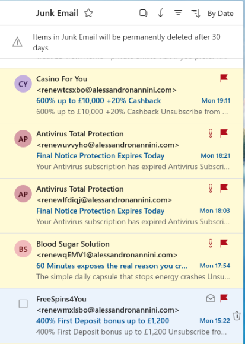

Notable patterns:

- consistent sender domain: `alessandronannini.com`  
- reply-to domain: `brendamurphyrealestate.com`  
- varied themes (casino, antivirus, health)  
- high frequency and similar formatting  

---

## Email Analysis

### Casino Email Examples

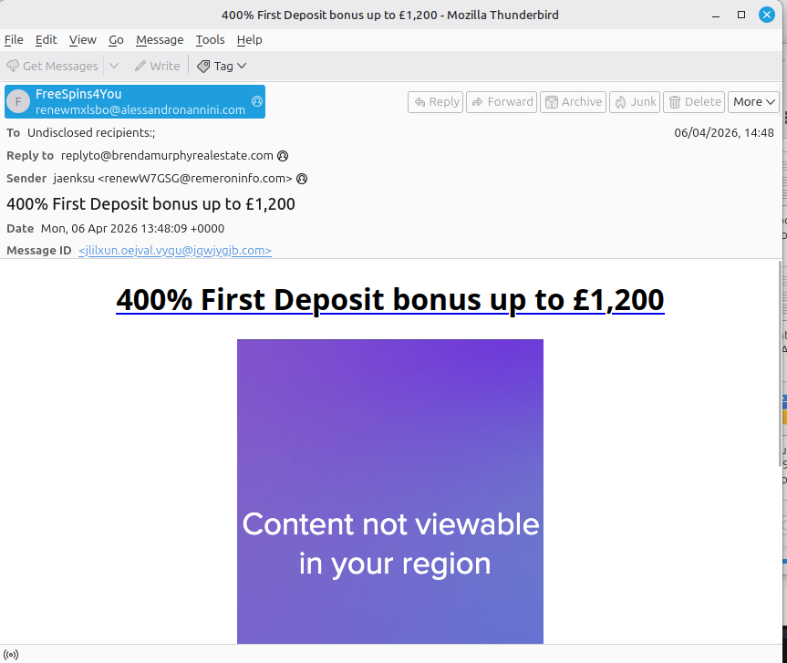

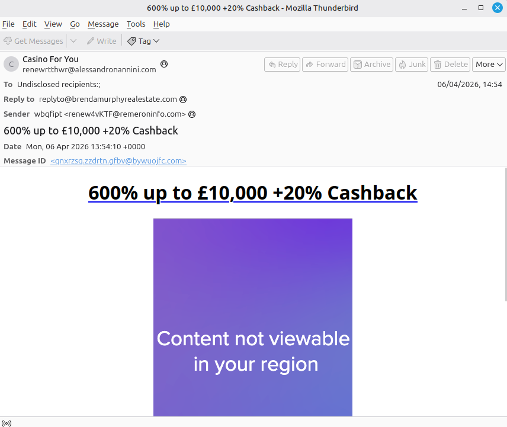

Characteristics:

- incentive-based messaging (free spins, bonuses)  
- simple HTML structure  
- embedded redirect links  
- consistent sender infrastructure  

---

### Antivirus Email Examples

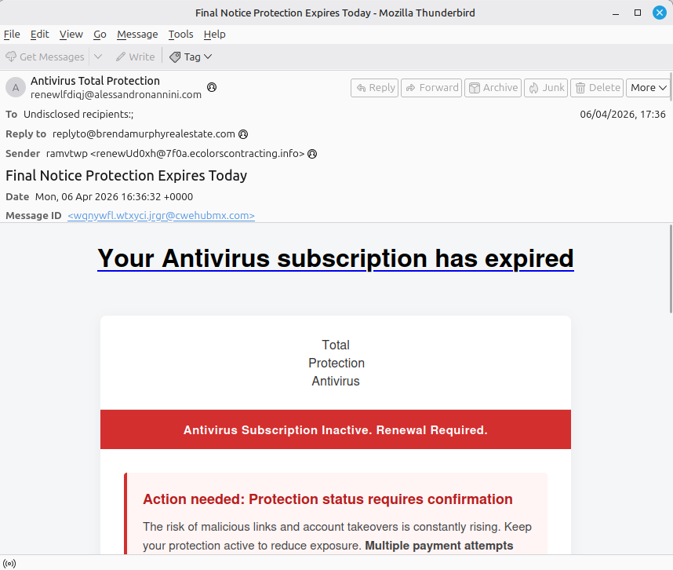

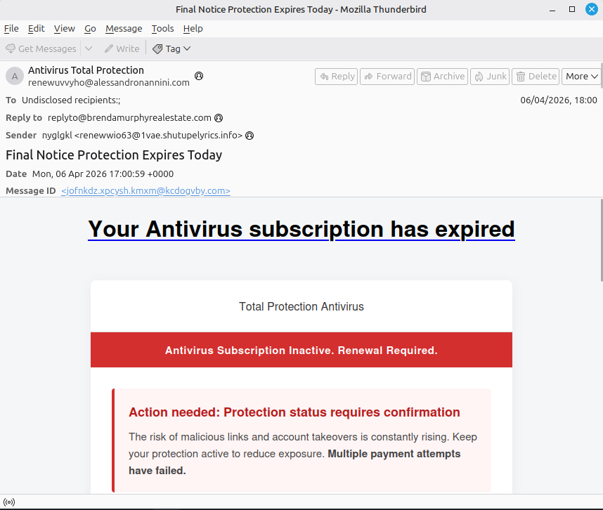

Characteristics:

- urgency-based messaging ("subscription expired")  
- fake security branding  
- pressure to act quickly  
- same backend infrastructure as casino emails  

---

## Redirect & Behaviour Analysis

### Casino Chains

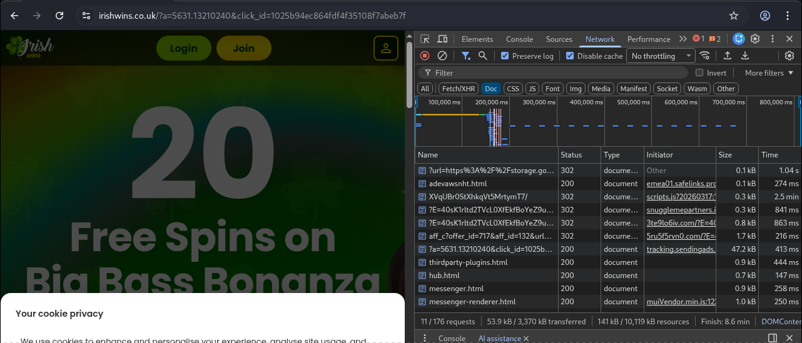

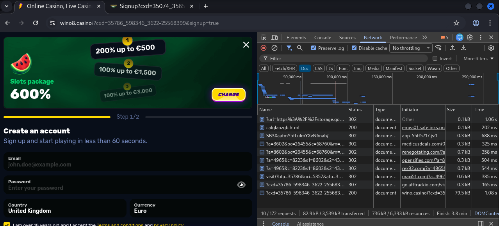

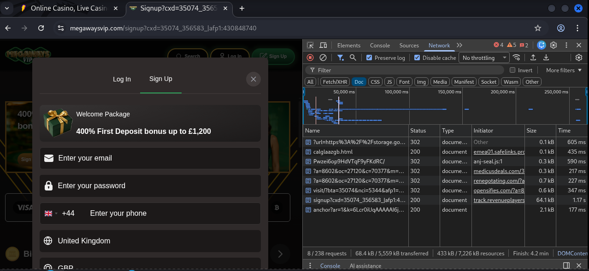

All casino emails followed:

- multiple HTTP 302 redirects  
- tracking parameters (e.g. `xcd`)  
- affiliate routing  
- final landing page delivery (see chain screenshots)  

---

### Antivirus Chains

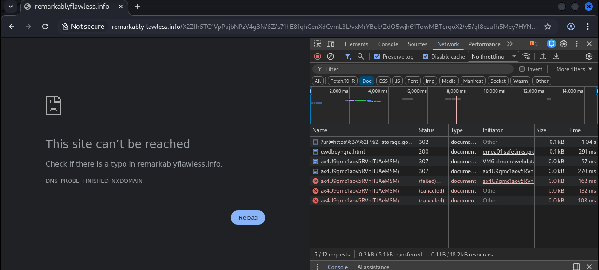

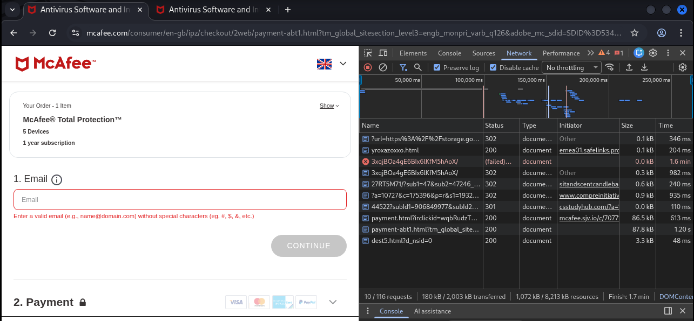

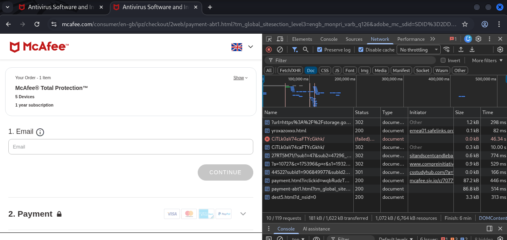

Observations:

- Antivirus 1 (March sample) chain is no longer functional  
- Antivirus 2 & 3 follow full redirect paths  
- same redirect structure as casino emails  
- same monetisation pattern  

---

### Behaviour Summary

Across all working chains:

- Microsoft Safelinks used as initial redirect  
- Google APIs used for content hosting / obfuscation  
- multiple intermediary redirect domains  
- affiliate tracking platforms (afftracko / revenueplayers)  
- final landing pages on legitimate services  

---

## Monetisation Flow

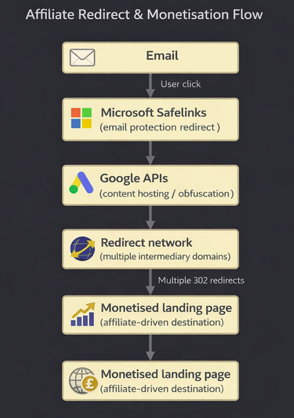

The flow is consistent:

Email  
→ Safelinks redirect  
→ Google-hosted payload  
→ redirect network  
→ affiliate tracking  
→ legitimate landing page  

This structure allows:

- tracking of user interactions  
- attribution to affiliates  
- revenue generation per conversion  

---

## Infrastructure Analysis

### alessandronannini.com

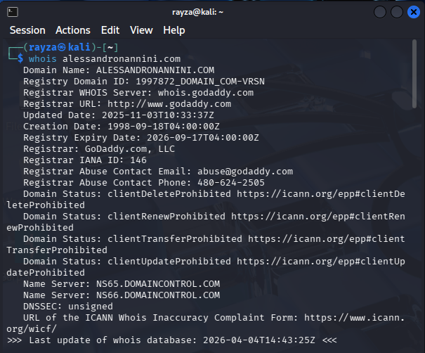

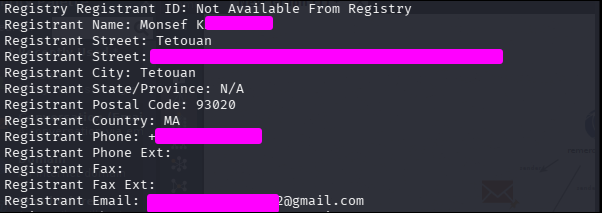

---

### brendamurphyrealestate.com

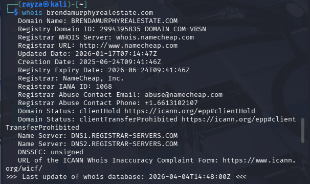

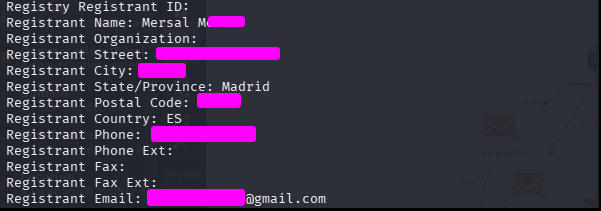

---

### remeroninfo.com

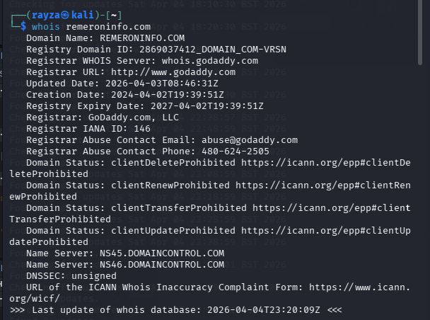

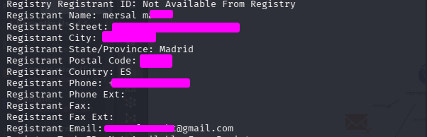

---

### Supporting Domains

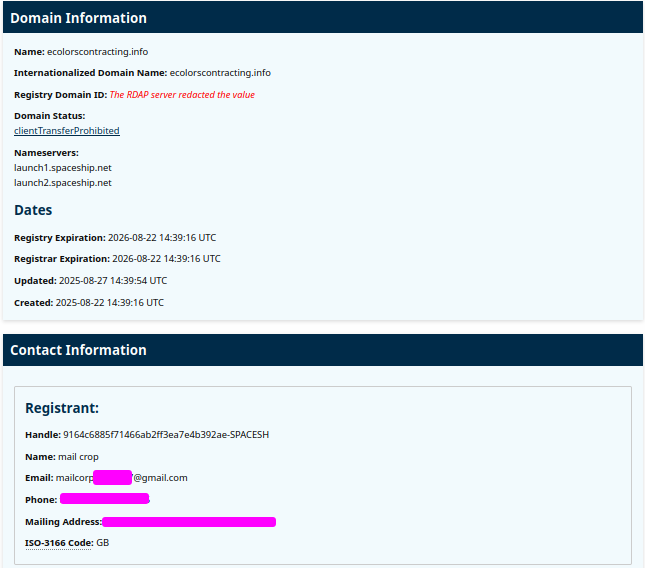

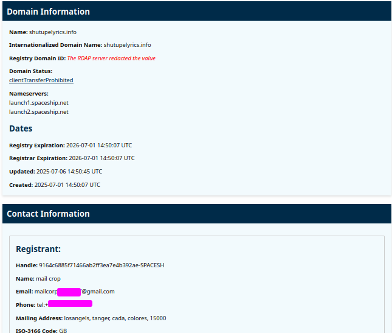

Notable observations:

- repeated registrant locations (Spain / Morocco)  
- reused email patterns  
- similar naming conventions  
- multiple domains supporting a single campaign  

---

## Campaign Infrastructure Mapping

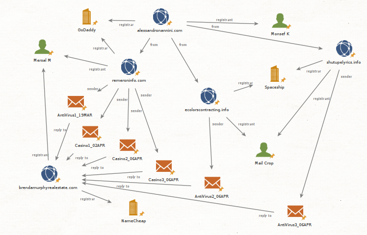

The Maltego graph shows:

- sender domains feeding multiple email campaigns  
- shared reply-to infrastructure  
- links between domains and registrants  
- registrar usage across providers (GoDaddy, Namecheap, Spaceship)  

This confirms the emails are part of a coordinated system rather than isolated spam.

---

## Indicators of Compromise (IOCs)

### Domains

- alessandronannini.com  
- brendamurphyrealestate.com  
- remeroninfo.com  
- ecolorscontracting.info  
- shutupelyrics.info  

### Behavioural Indicators

- multi-stage redirect chains  
- use of Microsoft Safelinks  
- Google APIs as intermediate hosts  
- affiliate tracking parameters (`xcd`, `click_id`)  

---

## Responsible Disclosure

Abuse reports have been submitted to the relevant registrars:

- GoDaddy (abuse@godaddy.com)  
- Namecheap (abuse@namecheap.com)  
- Spaceship  

These reports include:

- associated domains  
- evidence of coordinated activity  
- redirect behaviour and monetisation flow  

Disrupting these domains would likely impact the campaign’s effectiveness, although similar infrastructure could be re-established.

---

## Outcome

This investigation identified:

- shared infrastructure across multiple spam themes  
- clear links between domains and registrants  
- consistent redirect and monetisation behaviour  
- use of legitimate platforms as final endpoints  

The campaign operates as a structured affiliate funnel rather than a traditional phishing operation.

---

## Lessons Learned

- different email themes can share the same backend infrastructure  
- redirect chains reveal more than the email content itself  
- infrastructure mapping adds context that isolated analysis misses  
- monetisation patterns can expose the real objective  

---

## Final Thoughts

What started as a few spam emails turned into a mapped-out system of a structured, monetised campaign.

Different themes, same backend.

This investigation shows how:

- small indicators  
- repeated patterns  
- and infrastructure analysis  

can reveal the bigger picture behind seemingly low-level spam.

---
